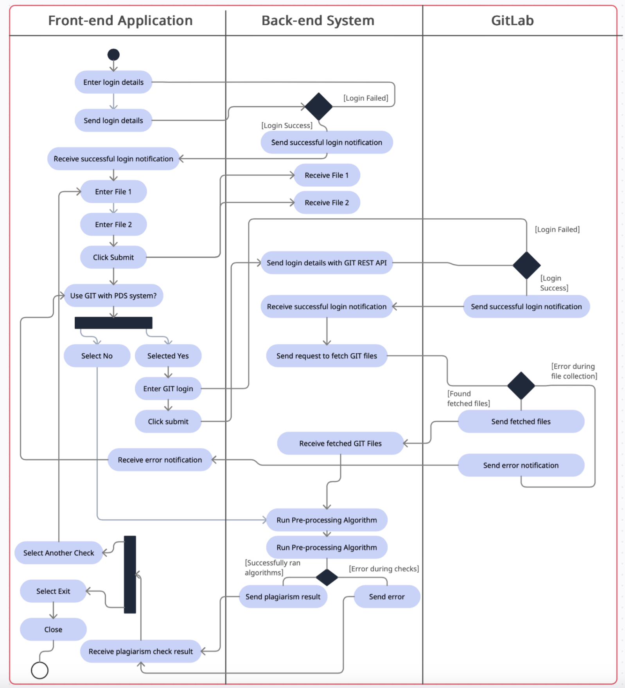
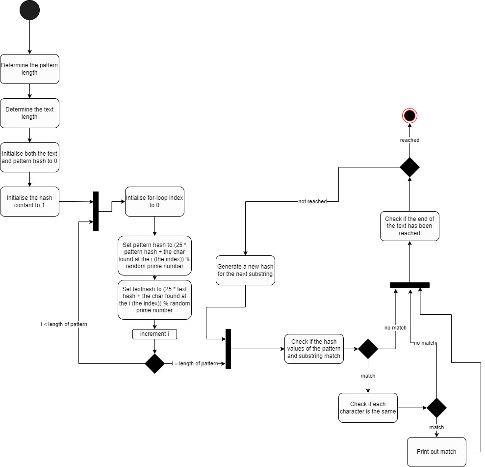
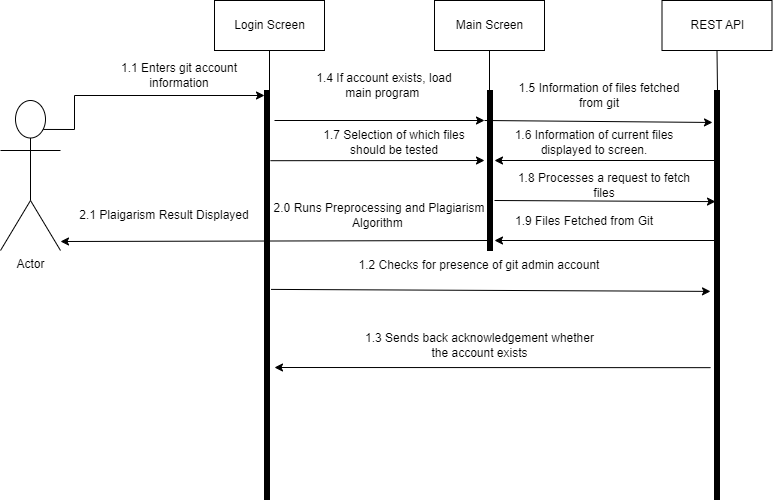

# Software Specifications

### Purpose

The purpose of this document is to outline the system specifications for the Plagiarism Detection software project. It shows how each of the System Requirements outlined [here](/documentation/requirements.md) will be acheived. Furthermore, it can be used as a development guide whilst implementing each feature as to what the system should do to fulfill each requirement, and referenced during unit testing.

This document is intended for members of Group 28, the project academic supervisor, and the COMP2002 module convenor.

## System Specifications

The specifications below detail what should be built for each of the requirements to be fulfilled. They are split into individual features which could be completed in a sprint cycle, and reference the Requirement No. of the respective requirement. 

Each specification should be referenced starting with it's Requirement No., followed by it's Specification No., e.g. 3.1.1.1.3.

#### 3.1.1 Similarity Algorithm

| Requirement No. | Specifications                                               |
| --------------- | ------------------------------------------------------------ |
| 3.1.1.1         | 1. The system shall quantify the result of its plagiarism assessment into a percentage between 1 and 100. 2. The system shall present this number using colour coding as a visual aid. 3. Similarity scores <33% should be presented in Green, between 33% and 66% in Yellow, and >66% in Red. |
| 3.1.1.2         | 1. The system shall execute an algorithm to check for Direct Plagiarism over each file submitted for plagarism detection. 2. The system shall use the result of this algorithm in conjuction with other detection algorithms to formulate a similarity score. |
| 3.1.1.3         | 1. The system shall execute an algorithm to check for Mosaic Plagiarism over each file submitted for plagarism detection. 2. The system shall use the result of this algorithm in conjuction with other detection algorithms to formulate a similarity score. |

#### 3.1.2 Direct File Comparison

| Requirement No. | Specifications                                                                                                                                                                                                                                                                                                                                                                                                                                            |
| --------------- | --------------------------------------------------------------------------------------------------------------------------------------------------------------------------------------------------------------------------------------------------------------------------------------------------------------------------------------------------------------------------------------------------------------------------------------------------------- |
| 3.1.2.1         | 1. Staff shall be presented with an upload button.  2. Staff shall be able to browse their local computer to select file(s) to upload. 3. Staff shall only be able to select .c and .py files. 4. The system will warn the user if they have already uploaded a file with the same filename, and be prompted to not upload or upload with a different filename. 5. Access to the uploaded files shall be restricted to only authorised users. |
| 3.1.2.2         | 1. The system shall present with a list of all the source code files they have uploaded and a submit option. 2. Staff shall be able to select 2 of these files, and shall be visually prompted as to which files they have chosen. 3. The system shall warn the user if less than or more than 2 files have been selected. 4. The system shall warn the user if the file types of the selected files are different.                              |
| 3.1.2.3         | 1. The system shall run the selected files through the detection algorithm to produce a similarity score. 2. The system shall output the similarity score between the files to the user.                                                                                                                                                                                                                                                               |
| 3.1.2.4         | 1. The system shall show a side-by-side comparison of the selected files. 2. The system shall highlight to the user which line(s) of each source code file have been detected to be plagiarised.                                                                                                                                                                                                                                                       |

#### 3.1.3 Batch File Comparison

| Requirement No. | Specifications                                                                                                                                                                                                                                                                                                                                                                                                                                                        |
| --------------- | --------------------------------------------------------------------------------------------------------------------------------------------------------------------------------------------------------------------------------------------------------------------------------------------------------------------------------------------------------------------------------------------------------------------------------------------------------------------- |
| 3.1.3.1         | 1. The system shall present with a list of all the source code files they have uploaded and a submit option. 2. Staff shall be able to select multiple of these files, and shall be visually prompted as to which files they have chosen. 3. The system shall warn the user if less than 1 file has been selected, and prevent the user from requesting comparison. 4. The system shall warn the user if the file types of the selected files are different. |
| 3.1.3.2         | 1. The system shall run all the selected files through the detection algorithm to produce a similarity score for each file against all the other selected files. 2. The system shall output the similarity score for each file to the user. 3. The system shall produce a report which presents the highest similarity files.                                                                                                                                   |
| 3.1.3.3         | 1. The system shall present all the processed files to the user to be selected. 2. Staff shall be able to select a file to view. 3. The system shall highlight to the user which line(s) of the selected source code file have been detected to be plagiarised.                                                                                                                                                                                                 |

#### 3.1.4 Git History Comparison

| Requirement No. | Specifications                                               |
| --------------- | ------------------------------------------------------------ |
| 3.1.4.1         | 1. The system shall present the user with a list a Git repositories. 2. Users shall be able to select two repositories from this list for comparison. |
| 3.1.4.2         | 1. The system shall authenticate with UoN School of Computer Science Gitlab servers. 2. Users shall be able to login to their Gitlab account. 3. The system shall presented the user with a list of Git Repositories from their account. 4. Users shall be able to select multiple repositories for comparison. |
| 3.1.4.3         | 1. The system shall present staff with a list of commits in each selected repository that are similar. 2. The system shall show staff when these commits were made. |
| 3.1.4.4         | 1. The system shall run all source code files in the selected repositories through the similarity algorithm. 2. The system shall output the similarity score for each file to the user. |

#### 3.1.5 User Operations

| Requirement No. | Specifications                                                                                                                                                                                                                                                                                                                                                                                                                                                          |
| --------------- | ----------------------------------------------------------------------------------------------------------------------------------------------------------------------------------------------------------------------------------------------------------------------------------------------------------------------------------------------------------------------------------------------------------------------------------------------------------------------- |
| 3.1.5.1         | 1. The system shall present a prospective user with a login screen. 2. Users shall be able to enter and submit their credentials. 3. The system shall check the submitted credentials are valid, allowing the user to progress if they are or prompting otherwise.                                                                                                                                                                                                |
| 3.1.5.2         | 1. The system should present a prospective user with the option to reset their password. 2. Users shall be able to provide the credentials they are aware of to identify themselves. 3. The system will prompt if the credentials they have provided are not sufficient. 4. If the provided credentials are sufficient, they shall be able to enter a new password. 5. The system should redirect to the login screen once their password has been changed. |
| 3.1.5.3         | 1. The system should present the user with a log out option if they have successfully logged in. 2. Users should be able to select this option at all times.                                                                                                                                                                                                                                                                                                         |

#### 3.1.6 Student User Management

| Requirement No. | Specifications                                                                                                                                                                                                                                                                                                                                                                                             |
| --------------- | ---------------------------------------------------------------------------------------------------------------------------------------------------------------------------------------------------------------------------------------------------------------------------------------------------------------------------------------------------------------------------------------------------------- |
| 3.1.6.1         | 1. The system shall present staff with a list of students, including their names and personal details, alongside any groups they belong to. 2. The system shall present staff with the option to create new students. 3. Staff shall be able to input student details manually, or upload a CSV file with student's details. 4. The system shall store the student data in an encrypted database. |
| 3.1.6.2         | 1. The system shall present staff with a list of students, including their names and personal details, alongside any groups they belong to. 2. The system shall present staff with the option to remove each student. 3. The system shall ask for confirmation of this action before it proceeds.                                                                                                    |
| 3.1.6.3         | 1. The system shall present staff with a list of groups. 2. The system shall present staff with the option to create new groups. 3. Staff shall be able to input group details into a form. 4. The system shall store the group data in an encrypted database.                                                                                                                                    |
| 3.1.6.4         | 1. The system shall present staff with a list of groups. 2. The system shall present staff with the option to remove each group. 3. The system shall ask for confirmation of this action before it proceeds.                                                                                                                                                                                         |
| 3.1.6.5         | 1. The system shall present staff with a list of groups. 2. Staff shall be able to select a group to add students to. 3. The system shall present staff with a list of students that are not already in this group. 4. Staff shall be able to select from this list which students they would like to add to the group.                                                                           |
| 3.1.6.6         | 1. The system shall present staff with a list of groups. 2. Staff shall be able to select a group to remove students from. 3. The system shall present staff with a list of the students in this group. 4. Staff shall be able to select from this list which students they would like to remove from the group.                                                                                  |
| 3.1.6.7         | 1. The system shall present staff with a list of students, including their names and personal details, alongside any groups they belong to. 2. Staff shall be able to select a student they want to view the plagiarism history of. 3. The system shall present staff with a list of all past assignments completed by the student and their similarity scores.                                      |

#### 3.1.7 Student Submission

| Requirement No. | Specifications                                                                                                                                                                                                                                                                                                                                                                                      |
| --------------- | --------------------------------------------------------------------------------------------------------------------------------------------------------------------------------------------------------------------------------------------------------------------------------------------------------------------------------------------------------------------------------------------------- |
| 3.1.7.1         | 1. The system shall present students with a list of all assignments that have been set for them and their groups, that have not already been submitted. 2. Students shall be able to select an option to see a list of all their submitted assignments.                                                                                                                                          |
| 3.1.7.2         | 1. Students shall be able to select an assignment to upload source code to. 2. Students shall be presented with an upload button.  3. Students shall be able to browse their local computer to select file(s) to upload. 4. Students shall only be able to select .c and .py files. 5. Students shall be able to confirm their submission.                                              |
| 3.1.7.3         | 1. The system shall run all uploaded files for the selected assignment through the detection algorithm to produce a similarity score for each file against all the other selected files. 2. The system shall output to the student the similarity score of their submission, if the assignment option allows. 3. Students shall be able to remove a submission and re-upload a new file       |
| 3.1.7.4         | 1. Students shall be able to confirm their submission for an assignment and submit. 2. The system shall prevent students from modifying their submission after they have confirmed it.                                                                                                                                                                                                           |
| 3.1.7.5         | 1. Staff shall be presented with an option to create an assignment. 2. Staff shall be able to input the details of the assignment, including a description and title.                                                                                                                                                                                                                            |
| 3.1.7.6         | 1. The system shall present staff with a list of all students when creating an assignment. 2. Staff shall be able to select which students they would like to complete the assignment.                                                                                                                                                                                                           |
| 3.1.7.7         | 1. The system shall present staff with a list of all groups when creating an assignment. 2. Staff shall be able to select which groups they would like to complete the assignment.                                                                                                                                                                                                               |
| 3.1.7.8         | 1. The system shall present staff with the option to allow students to view their similarity score before submission when creating an assignment.                                                                                                                                                                                                                                                   |
| 3.1.7.9         | 1. Staff shall be able to choose a date and time that the assignment should be submitted by. 2. The system shall present a warning to staff is this due date is in the past. 3. The system shall prevent students from uploading files to the assignment after this date and time.                                                                                                            |
| 3.1.7.10        | 1. The system shall present a list of all students assigned to the chosen assignment. 2. Each student's similarity score for their submission shall be displayed next to their details. 3. Staff shall be able to select a student to view their submission. 4. The system shall highlight to the user which line(s) of the selected source code file has been detected to be plagiarised. |

# Diagrams

## Activity Diagram (including REST API)

This diagram highlights the inner-workings of the system and how it will interact with gits' REST api to retrieve different versions of plaigarised code.

## Activity Diagram (excluding REST API)

This diagram highlights in depth how the system would detect plaigarised code assuming functionality of gits' REST API.

## Sequence Diagram

The sequence diagram demonstrate how the user would interact with the system, including the necessary functionality the system would implement to acheive this.

